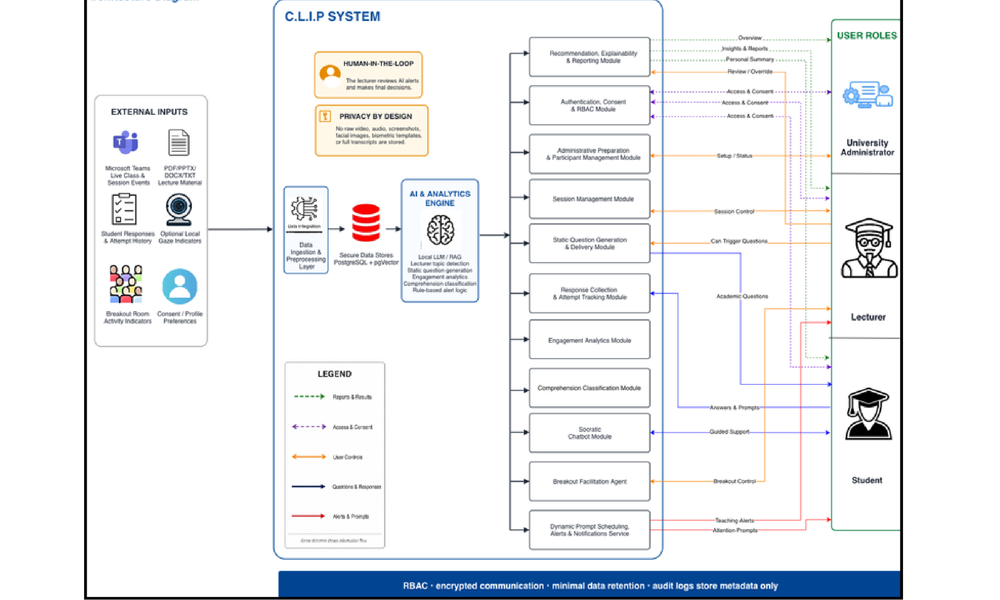
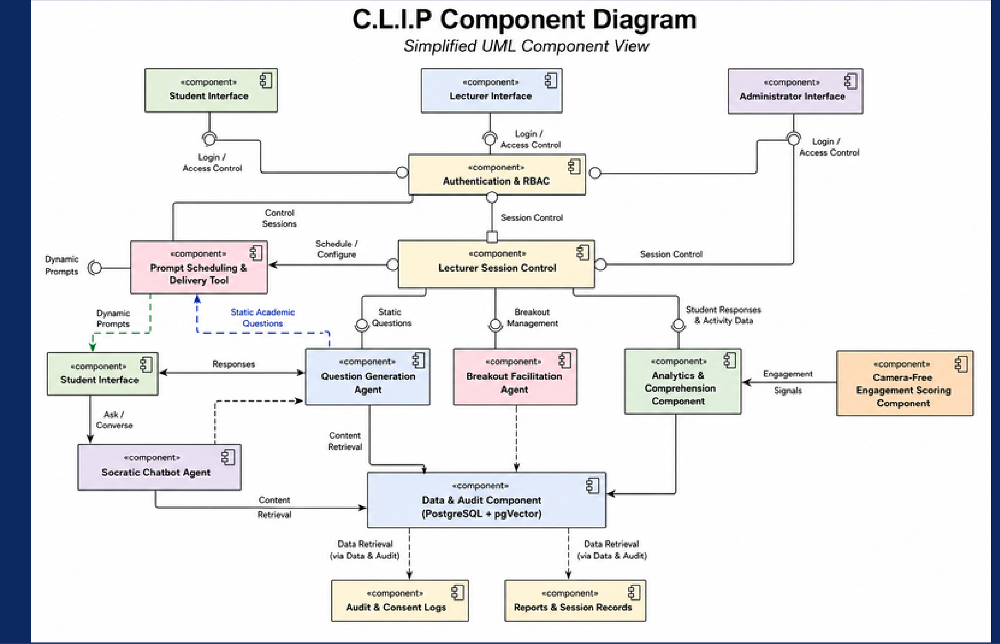
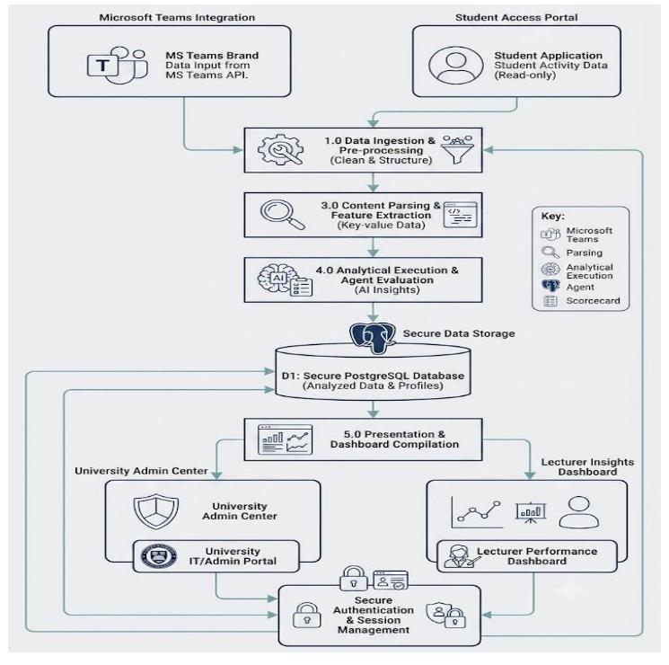
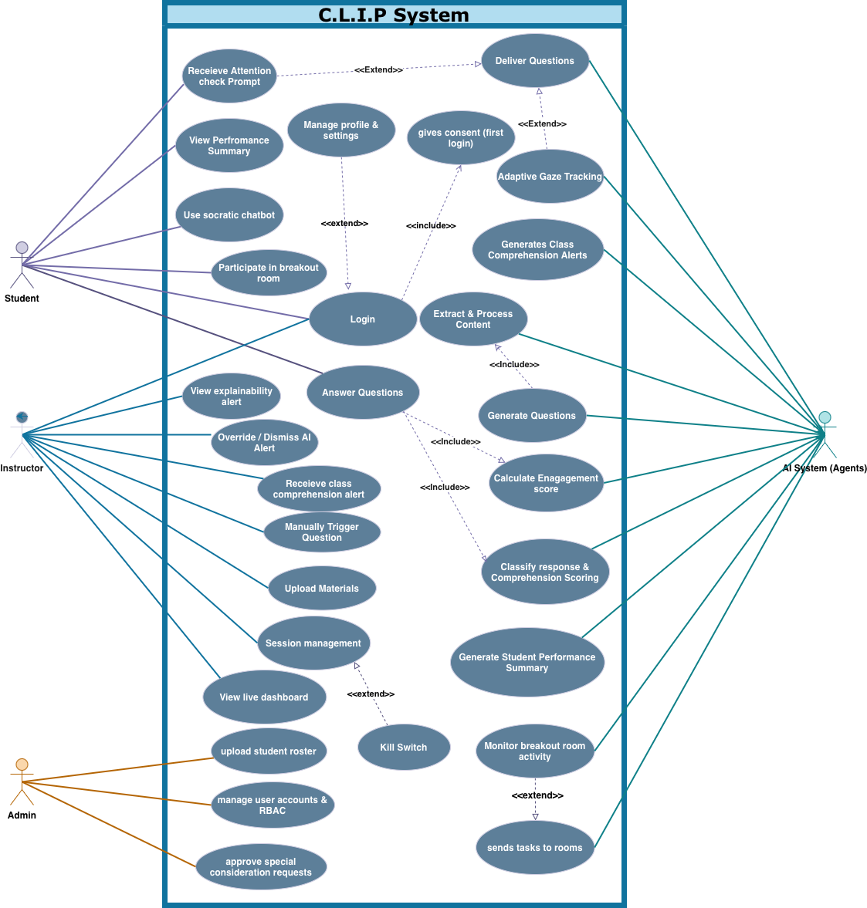
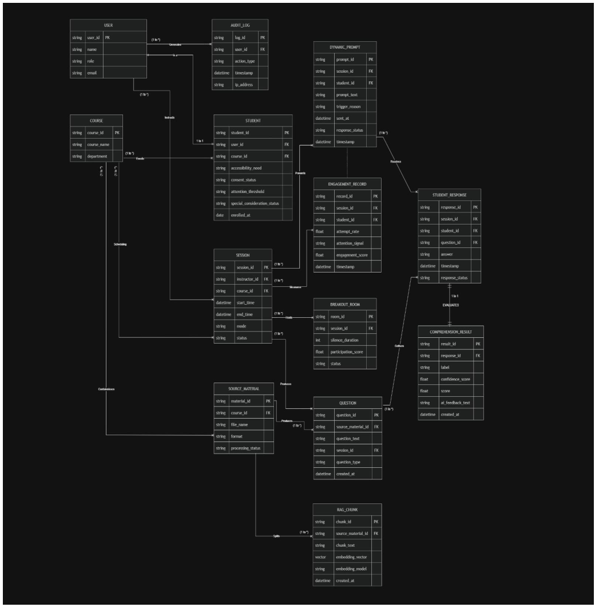
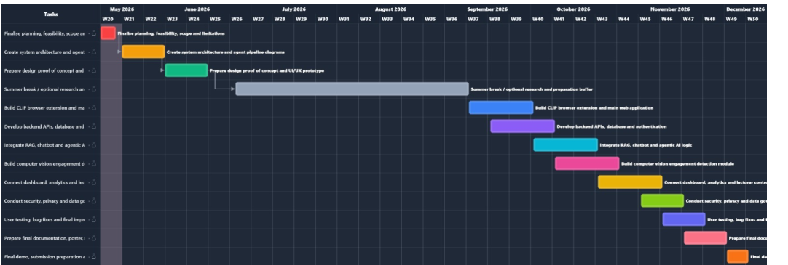

# C.L.I.P - Cognitive Learning Intelligence Platform

## Project Overview

C.L.I.P is an AI engagement assistant for live online university classes, delivered as a
Microsoft Teams app. It was built as the CSIT321 Capstone Project by Team 4 at the
University of Wollongong in Dubai, supervised by Dr. Farhad Oroumchian.

In an online lecture a student can join, switch their camera off and disengage without
anyone noticing until an assessment weeks later. Existing classroom tools (Slido,
ClassPoint, Mentimeter, Nearpod) are triggered by the lecturer and measure participation
rather than understanding. C.L.I.P runs continuously in the background of the class:

- Before the class, it turns the lecturer's own slides and notes into short
  comprehension checks, which the lecturer reviews and approves.
- During the class, it delivers a checkpoint every 15 to 20 minutes, classifies each
  answer as **mastered**, **partial** or **struggling**, and tracks engagement from
  participation signals that are processed on the student's own device.
- It shows the lecturer, in real time, who is following and who is lost, with an
  explanation for every alert, while there is still time to act.

C.L.I.P is **not** a grading system, a proctoring tool or a replacement for the lecturer.
The AI suggests and the lecturer decides. No raw video, audio or transcripts are ever
stored, and every model runs on our own hardware, so no student data is sent to a
third-party AI service.

The platform serves three roles: **students**, who answer checkpoints and see their own
progress; **lecturers**, who prepare material and run the live class; and
**administrators**, who import the timetable and rosters and govern access.

## Website

> Placeholder: the project website has not been published yet.

- Website: `TBD`
- Figma prototype: [Student Meeting Helper](https://www.figma.com/make/jo2GCIds0CExSKltEoG5tZ/Student-Meeting-Helper)

## Demo Video

> Placeholder: the demonstration video will be recorded once the Teams integration is
> running in a tenant. Replace `VIDEO_ID` below with the YouTube id.

<!--
[](https://www.youtube.com/watch?v=VIDEO_ID)
-->

## Architecture

C.L.I.P is organised in three layers. The Teams client and the web frontend present it,
a single FastAPI process runs the REST API, the live WebSocket hub, the Teams bot and the
AI pipeline, and PostgreSQL with pgvector holds everything that must outlive a session.

```
+--------------------------------------------------------------------------+
|                           Presentation layer                             |
|  Microsoft Teams: meeting side panel, personal tabs    React + Vite app  |
|  Student panel | Lecturer dashboard | Admin console | Consent and login  |
+-------------+-------------------------------+----------------------------+
              | HTTPS (REST, /api/v1)         | WebSocket (/ws/session)
              v                               v
+--------------------------------------------------------------------------+
|                     Application and AI layer (FastAPI)                   |
|                                                                          |
|  Auth, RBAC, consent     Session lifecycle        Teams bot (/teams)     |
|  Timetable and roster    Live classroom: question  Meeting start and end  |
|  import                  cycle, answers, prompts,                        |
|                          presence, alerts                                |
|                                                                          |
|  Content pipeline:  upload -> extraction -> chunking -> embeddings       |
|                     -> question generation -> lecturer review            |
|  Engagement and comprehension analytics, explainability                  |
+-------------+-------------------------------+----------------------------+
              | SQLAlchemy (async)            | HTTP
              v                               v
+-------------------------------+   +--------------------------------------+
|  PostgreSQL 16 + pgvector     |   |  Ollama (local)                      |
|  users, consent, courses,     |   |  qwen2.5 for question generation     |
|  sessions, material, chunks,  |   |  nomic-embed-text for embeddings     |
|  questions, responses,        |   +--------------------------------------+
|  engagement, audit log        |
+-------------------------------+
```

- **Presentation.** Students use the meeting side panel during class and a personal tab
  outside it. Lecturers and administrators use personal tabs. The same React app runs
  outside Teams, which is how it is developed and tested until a tenant is available.
- **REST API.** Every route is versioned under `/api/v1`, and the whole interface is
  generated into `backend/openapi.json`, which CI keeps in step with the code.
- **Live classroom.** One WebSocket per participant carries questions, answers,
  feedback, attention prompts, presence and alerts. Events are numbered per channel, so
  a client that reconnects is replayed what it missed. The contract is
  `backend/events.schema.json`.
- **Teams bot.** Teams posts meeting start and end events to the bot, which starts and
  ends the linked C.L.I.P session. Until a tenant is available, a mock adapter posts the
  same events.
- **AI.** Models run locally through Ollama. Camera and microphone signals are processed
  in the student's browser, and only numeric indicators reach the server.

The full design, from the design document and the system design presentation:



<details>
<summary>Component diagram</summary>



</details>

<details>
<summary>Data flow diagram</summary>



</details>

<details>
<summary>Use case diagram</summary>



</details>

## AI Pipeline

The AI work is split into what happens before a class, which can take minutes, and what
happens during it, which must take seconds.

```
 BEFORE THE CLASS                                  DURING THE CLASS
 ----------------                                  ----------------
 Lecturer uploads PDF / PPTX / DOCX / TXT          Session starts (dashboard or Teams)
          |                                                 |
          v                                                 v
 [1] Extraction and chunking                       [3] Question cycle
     text, slides, tables -> chunks                    every 15-20 min, 30 s window
          |                                                 |
          v                                                 v
 [2] Embeddings and question generation            [4] Classification and feedback
     nomic-embed-text -> pgvector                      mastered / partial / struggling
     qwen2.5 + retrieved chunks -> questions                |
          |                                                 v
          v                                        [5] Engagement and alerts
 Lecturer reviews: approve, edit,                      engagement score per student,
 regenerate or reject                                  class comprehension alert,
          |                                            attention prompts
          v                                                 |
 Approved questions staged for the session                  v
                                                   Lecturer dashboard, with reasons
```

### Phase 1 - Extraction and chunking

**Input:** a PDF, PPTX, DOCX or TXT file uploaded by the lecturer, up to 50 MB
(`MAX_UPLOAD_BYTES`).

The upload is written to storage and answered with `202 Accepted` at once. Extraction
runs in a background worker, off the event loop, so a large deck never stalls a live
class on the same server. Text, slide structure and tables are extracted, split into
chunks, and progress is pushed to the lecturer's own WebSocket channel stage by stage.

### Phase 2 - Embeddings and question generation

Each chunk is embedded with `nomic-embed-text` (768 dimensions) and stored in pgvector.
Questions are generated by `qwen2.5` from retrieved chunks, so every question is grounded
in the lecturer's material and carries the slide it came from. Malformed drafts (an answer
key that points at no option, repeated options) are dropped before storage. Nothing
reaches students until the lecturer approves it.

### Phase 3 - The live question cycle

Once a session starts, the classroom delivers an approved question every 15 to 20 minutes
(`CHECKPOINT_INTERVAL_MIN_SECONDS`, `CHECKPOINT_INTERVAL_MAX_SECONDS`), or when the
lecturer sends one manually. Each question is open for 30 seconds
(`CHECKPOINT_RESPONSE_WINDOW_SECONDS`). The timer pauses with the class, and a student who
joins late is shown the question that is open.

### Phase 4 - Classification and feedback

Multiple-choice answers are scored deterministically against the lecturer-approved answer
key, and the feedback cites the slide the question came from. A right answer is labelled
**mastered** and a wrong one **struggling**. Free-text answers are accepted and stored
now, and will be classified into **mastered**, **partial** or **struggling** by the
language model in Phase 5. Each student receives private feedback on their own answer,
and the correct answer is revealed when the window closes.

### Phase 5 - Engagement scoring and alerts

- **Engagement score.** Combines questions answered, response times, responses to
  attention prompts and, only with consent, on-device attention signals. Declining
  camera or microphone consent never lowers a score.
- **Attention prompts.** A private "are you still with us?" prompt after two missed
  questions in a row, capped at three per student per session.
- **Class comprehension alert.** Raised to the lecturer when at least 50% of at least five
  respondents are partial or struggling on a topic, with the reason shown.

## Tech Stack

| Layer | Technology |
|---|---|
| Client | Microsoft Teams app: meeting side panel, personal tabs, bot |
| Frontend | React, TypeScript, Vite, Tailwind CSS, TeamsJS |
| Backend | Python 3.12, FastAPI, Uvicorn, Pydantic |
| Real time | WebSockets, with per-channel sequence numbers and replay |
| Database | PostgreSQL 16 with pgvector, SQLAlchemy (async), asyncpg, Alembic |
| AI | Ollama (local): qwen2.5, nomic-embed-text |
| Document parsing | PDF, PPTX, DOCX and TXT extraction; CSV and XLSX for imports |
| Security | JWT access tokens, bcrypt, role-based access control, consent gating |
| Teams | Bot Framework token validation (PyJWT, RS256), Teams app manifest |
| Testing and CI | pytest, Ruff, GitHub Actions, contract drift checks |
| Infrastructure | Docker Compose for the database |

## Project Structure

```
.
+-- backend/
|   +-- app/
|   |   +-- api/v1/          REST routes and the WebSocket endpoint, versioned
|   |   +-- auth/            tokens, password handling, consent
|   |   +-- core/            configuration, database, errors, logging
|   |   +-- models/          SQLAlchemy tables
|   |   +-- realtime/        WebSocket hub and the live classroom
|   |   +-- repositories/    queries, kept out of the routes
|   |   +-- schemas/         request, response and event contracts
|   |   +-- services/        extraction, storage, jobs, pipeline, lifecycle, Teams bot
|   +-- migrations/          Alembic migrations
|   +-- scripts/             contract export, Teams packaging, mock meeting driver
|   +-- tests/               pytest, mirroring the app layout
|   +-- openapi.json         REST contract, generated
|   +-- events.schema.json   WebSocket contract, generated
+-- frontend/                React app: student, lecturer and admin interfaces
+-- teams-app/               Teams manifest, icons and packaging notes
+-- samples/                 example timetable and roster CSVs
+-- docs/images/             architecture and design diagrams
+-- docker-compose.yml       PostgreSQL with pgvector
```

## Features

### Student

- Sign in, and grant or decline each kind of consent separately
- Answer live checkpoints in the Teams meeting side panel
- Private feedback on each answer, and the correct answer when the question closes
- Private attention prompts, answered with "I'm here" or dismissed
- Classes resume where they left off after a dropped connection
- Personal performance summary after the session (planned, Phase 7)
- Socratic chatbot that gives hints rather than answers (planned, Phase 5)

### Lecturer

- Upload lecture material and follow its processing live
- Review generated questions: approve, edit, regenerate or reject, singly or in bulk
- Create, start, pause, resume and end sessions, from the dashboard or from Teams
- Send a question manually at any point
- Live view of who is present, who answered and how the class is doing
- Class comprehension alerts with the reason for each
- Link a session to a Teams meeting so the meeting starts and ends it (Phase 4)
- Breakout room facilitation (planned, Phase 6)

### Administrator

- Import the timetable and student rosters from CSV, which create courses, users and
  enrolments
- System status: database and model availability
- Audit logs and data retention governance (planned, Phase 7)

## API Endpoints

All routes are under `/api/v1`. Interactive documentation is served at `/docs` in
development. Routes marked **501** have an agreed contract and name the workstream that
will implement them.

| Method | Endpoint | Auth | Description |
|---|---|---|---|
| GET | `/health` | none | Liveness, and whether Teams is configured |
| GET | `/ready` | none | Whether PostgreSQL and Ollama are reachable |
| POST | `/auth/login` | none | Sign in and receive an access token |
| GET | `/auth/me` | any | The signed-in user, with role and consents |
| POST | `/auth/consent` | any | Grant or withdraw one kind of consent |
| POST | `/admin/timetable` | admin | Import the timetable CSV |
| POST | `/admin/roster` | admin | Import a course roster CSV |
| POST | `/materials` | lecturer, admin | Upload a lecture file for processing |
| GET | `/materials` | lecturer, admin | List uploaded material |
| GET | `/materials/{material_id}` | lecturer, admin | One material and its processing state |
| GET | `/materials/{material_id}/questions` | lecturer, admin | Generated questions for review |
| PATCH | `/materials/{material_id}/questions/{question_id}` | lecturer, admin | Approve, edit or reject a question |
| POST | `/materials/{material_id}/questions/{question_id}:regenerate` | lecturer, admin | Generate a replacement question |
| POST | `/materials/{material_id}/questions:bulk` | lecturer, admin | Review several questions at once |
| POST | `/sessions` | lecturer, admin | Create a session for a course |
| GET | `/sessions` | any | List sessions (**501**, BBIS, Phase 3) |
| GET | `/sessions/{session_id}` | any | One session (**501**, BBIS, Phase 3) |
| POST | `/sessions/{session_id}/start` | lecturer, admin | Start the class |
| POST | `/sessions/{session_id}/pause` | lecturer, admin | Pause the class and its question timer |
| POST | `/sessions/{session_id}/resume` | lecturer, admin | Resume the class |
| POST | `/sessions/{session_id}/end` | lecturer, admin | End the class |
| GET | `/sessions/{session_id}/questions` | lecturer, admin | Approved questions that can be delivered |
| POST | `/sessions/{session_id}/questions/{question_id}:deliver` | lecturer, admin | Send a question now |
| GET | `/sessions/{session_id}/responses` | lecturer, admin | Answers received (**501**, BBIS, Phase 3) |
| GET | `/sessions/{session_id}/engagement` | lecturer, admin | Engagement score per student |
| GET | `/sessions/{session_id}/alerts` | lecturer, admin | Class comprehension alerts |
| GET | `/sessions/{session_id}/summary/{student_id}` | student, staff | Performance summary (**501**, Cyber 1, Phase 7) |
| WS | `/ws/session` | token | Live classroom events, see `events.schema.json` |

The Teams meeting routes (`/meetings/{meeting_id}`, `/meetings/events`) and the bot
endpoint (`/teams/messages`) are added in Phase 4.

## Getting Started

### Prerequisites

- Python 3.11 to 3.13 (CI uses 3.12)
- Node.js LTS
- Docker, for the database
- [Ollama](https://ollama.com), for the local models

Configuration lives in `backend/.env`, copied from `backend/.env.example`. The defaults
work for local development.

| Variable | Purpose |
|---|---|
| `DATABASE_URL` | PostgreSQL connection, matching `docker-compose.yml` |
| `OLLAMA_BASE_URL` | Where Ollama is listening |
| `CLIENT_ID`, `CLIENT_SECRET`, `TENANT_ID` | Teams bot registration; leave empty to run without Teams |

### Setup

```bash
# 1. Database
docker compose up -d

# 2. Models
ollama pull qwen2.5
ollama pull nomic-embed-text

# 3. Backend, on http://localhost:8000
cd backend
python -m venv .venv
.venv/Scripts/activate      # Windows
source .venv/bin/activate   # macOS and Linux
pip install -e ".[dev]"
cp .env.example .env
alembic upgrade head
uvicorn app.main:app --reload

# 4. Frontend, on http://localhost:5173
cd frontend
npm install
npm run dev
```

Check that everything came up:

```bash
curl http://localhost:8000/api/v1/ready
```

It reports whether PostgreSQL and Ollama are reachable, and names what is wrong when they
are not.

Run the backend as a single process. A live session's question timer is held in the
process that runs it, so with `WEB_CONCURRENCY` above 1 the backend warns in development
and refuses to start in production.

### Demo Accounts

Development builds seed one account per role, held in memory. Production reads accounts
from the database only, so these do not exist there.

| Role | Email | Password |
|---|---|---|
| Student | `student@clip.example.com` | `StudentPass123!` |
| Lecturer | `lecturer@clip.example.com` | `LecturerPass123!` |
| Administrator | `admin@clip.example.com` | `AdminPass123!` |

`samples/` holds a timetable and roster to import as the administrator.

### Running with Microsoft Teams

The Teams integration stays dormant until a tenant is available: `/health` reports
`teams_configured: false` and the app runs standalone. `teams-app/README.md` covers
building the app package, the dev tunnel, and driving meeting events without Teams
through the mock adapter.

### Checks

CI runs the same checks, from `backend/`:

```bash
ruff check . && ruff format --check .
pytest -q
python scripts/export_contract.py --check
```

The tests need the database from `docker compose up -d`. The frontend has its own:
`npx tsc -b`, `npm run lint` and `npm run build` from `frontend/`.

After changing any schema, regenerate the contract with
`python scripts/export_contract.py` and commit it.

### Troubleshooting

| Problem | Cause | Fix |
|---|---|---|
| `/ready` reports the database unavailable | The container is not running | `docker compose up -d`, and check Docker Desktop is started |
| Many tests are skipped | The test database is unreachable | Start the database; the suite skips database tests without it |
| `/ready` reports Ollama unavailable | Ollama is not running or the models are missing | Start Ollama and run both `ollama pull` commands |
| Backend refuses to start in production | More than one worker, or a required store is not registered | Run a single process; the log names what is missing |
| CI fails on the contract check | A schema changed without regenerating | `python scripts/export_contract.py`, then commit both files |
| Teams routes answer 503 | No bot registration is configured | Expected until a tenant exists; use the mock adapter |

## Database Schema



| Table | Purpose |
|---|---|
| `user`, `student` | Accounts, roles and student profiles |
| `consent` | Each consent decision, granted or withdrawn, with its time |
| `course` | Courses from the imported timetable, and their rosters |
| `session` | A class: its course, lecturer, schedule and status |
| `session_participant`, `session_activity` | Who attended, and when they joined and left |
| `material`, `material_processing_status` | Uploaded files and their progress through the pipeline |
| `extraction_element`, `rag_chunk` | Extracted content and its embedded chunks (pgvector) |
| `question` | Generated questions and their review state |
| `delivered_question` | Each question as delivered in a session, and how it closed |
| `student_response`, `missed_response` | Answers received, and questions a student let pass |
| `comprehension_result` | The label and feedback for each answer |
| `engagement_record` | Engagement scores over a session |
| `dynamic_prompt` | Attention prompts sent, and how each was answered |
| `breakout_room` | Breakout groups (Phase 6) |
| `ai_model_run` | Which model produced what, for explainability |
| `audit_log` | Security-relevant events, metadata only |

## Privacy and Security

These are enforced in code, not only promised in documentation.

- No raw video, audio, screenshots or transcripts are ever stored.
- Camera and microphone processing happens on the student's own device. Only numeric
  indicators leave it, and no event type can carry anything else.
- Every monitoring feature needs its own consent. Declining one never blocks another, and
  never lowers a student's score.
- Engagement and comprehension are measured separately, and neither is an assessment.
- Every role is checked on the server; Teams context is never trusted for authorisation.
- Session data is deleted after 90 days, in line with UAE Federal Decree-Law No. 45 of
  2021 on the Protection of Personal Data.

## Project Status

Work is organised into nine phases. Each phase is a slice across all six workstreams
rather than a component, so every phase ends with something that runs end to end. The
[milestones](../../milestones) are the source of truth for status per issue.

| Phase | Covers | State |
|---|---|---|
| 0 | Repository, CI, database and feasibility spikes | Done |
| 1 | Data and API spine: authentication, RBAC, consent, the API contract | Done |
| 2 | Content and question pipeline | Done |
| 3 | Live session core: WebSocket hub, question cycle, session lifecycle | In progress |
| 4 | Microsoft Teams integration | In progress |
| 5 | AI intelligence layer: free-text classification, Socratic chatbot | Planned |
| 6 | Attention signals and breakout groups | Planned |
| 7 | Reporting, retention and governance | Planned |
| 8 | Hardening, load testing and delivery | Planned |



## Documentation

> Placeholders: links will be added as each document is published.

| Document | Link |
|---|---|
| Proposal | `TBD` |
| Planning and Feasibility Report | `TBD` |
| Requirements Analysis (SRS) | `TBD` |
| Design Document | `TBD` |
| Test Plan | `TBD` |
| Final Report | `TBD` |
| Poster | `TBD` |

## Team

Team 4, CSIT321 Capstone Project, University of Wollongong in Dubai, 2026.

| Name | Student ID | Workstream | GitHub |
|---|---|---|---|
| Aliyeh Afshoonkar (Team Leader) | 8515268 | Cyber Security 2 | [@aliyeh-afk](https://github.com/aliyeh-afk) |
| Luna Zidan | 8501026 | AI 1 | [@lunazidan](https://github.com/lunazidan) |
| Joel Raju | 8880840 | AI 2 | [@joel-cdev](https://github.com/joel-cdev) |
| Hunain Raza | 8155069 | Cyber Security 1 | [@hunainraza1](https://github.com/hunainraza1) |
| Nour Abufadda | 8331820 | BBIS | [@nourabufadda](https://github.com/nourabufadda) |
| Shezin Khaiser | 8419277 | General Computer Science | [@ShezinKhais](https://github.com/ShezinKhais) |

**Supervisor:** Dr. Farhad Oroumchian, Faculty of Engineering and Information Sciences.

## Acknowledgements

We thank Dr. Farhad Oroumchian for his supervision and guidance throughout the project,
and the University of Wollongong in Dubai for its support.
